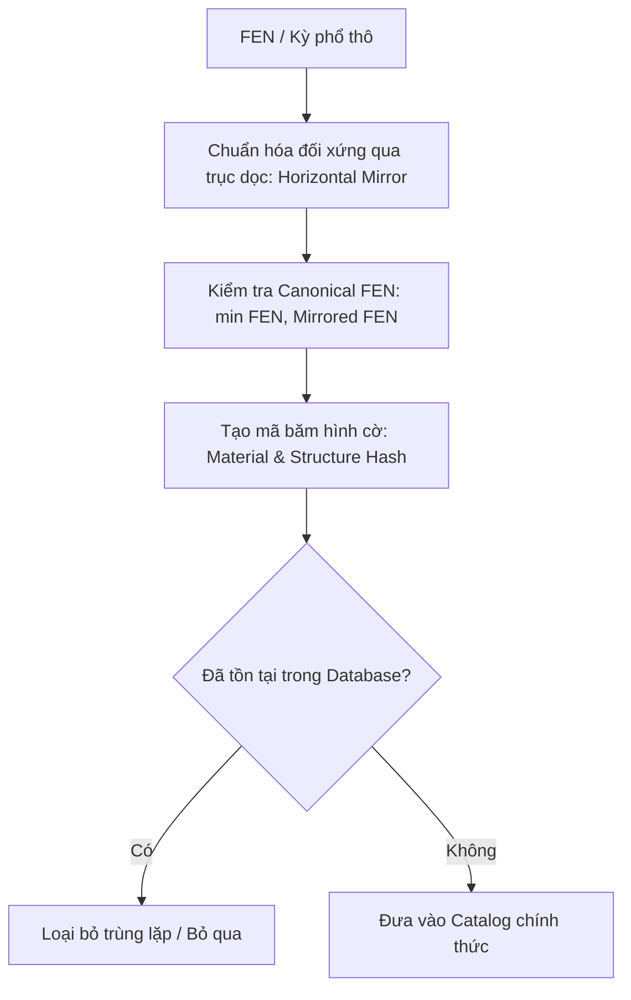

# KẾ HOẠCH TỔNG THỂ SERIES 1.000 TẬP "TINH HOA CỜ TÀN"
**Tác giả & Chủ nhiệm:** Thầy Nguyễn Văn Sang  
**Hệ thống sản xuất tự động:** Manim + Typst + Pikafish Engine + Edge/Zalo TTS + GitHub Actions CI/CD

---

## I. MỤC TIÊU & TẦM NHÌN
Xây dựng một thư viện video cờ tàn toàn diện, đồ sộ và chuẩn mực nhất Việt Nam với **hơn 1.000 video bài giảng**, được phân cấp sư phạm từ cơ bản đến đỉnh cao thực chiến và cờ thế cổ điển.
* **Tiêu chuẩn chất lượng**: 100% video chuẩn thuật ngữ cờ tướng truyền thống (**Tiến, Thoái, Bình**, đánh số cột 1–9 theo từng bên).
* **Độ chính xác tuyệt đối**: Kiểm chứng bằng engine **Pikafish** và thuật toán giải ngược không gian trạng thái (Retrograde Solver).
* **Tự động hóa hoàn toàn**: Không cần nhập tay từng ván; hệ thống tự động lọc trùng (Deduplication), tự động phân tích biến và tự động sinh kịch bản video.

---

## II. GIÁO TRÌNH PHÂN CẤP 1.000 TẬP (CURRICULUM ROADMAP)

### Học phần 1: Cờ Tàn Đơn Binh Chủng Căn Bản (Tập 0001 – 0150)
*Nền tảng của nghệ thuật cờ tàn: Hiểu rõ công năng, sức mạnh và giới hạn của từng quân cờ.*
* **Chuyên đề 1.1: Tàn Binh (Tốt)** (Tập 0001 – 0035)
  * Đơn Binh thắng Đơn Tướng (Tốt nhập cung, khóa tướng).
  * Đơn Binh vs Đơn Sĩ / Đơn Tượng (Các thế khéo thắng và thế hòa).
  * Song Binh, Tam Binh công phá Sĩ Tượng toàn.
* **Chuyên đề 1.2: Tàn Mã** (Tập 0036 – 0070)
  * Mã phá Đơn Sĩ (Tập 1: các biến vị trí).
  * Mã khéo thắng Đơn Tượng (Tập 2: chiếm trung lộ, ép Tượng ra biên).
  * Mã vs Song Sĩ, Mã vs Song Tượng (Các thế khéo thắng khi đối phương lạc vị).
  * Mã vs Sĩ Tượng toàn (Thế hòa quy phạm và cạm bẫy).
* **Chuyên đề 1.3: Tàn Pháo** (Tập 0071 – 0105)
  * Pháo vs Đơn Sĩ, Pháo vs Đơn Tượng.
  * Pháo vs Song Sĩ (Pháo mượn Tướng làm ngòi).
  * Pháo vs Song Tượng (Thế cờ hòa căn bản và thế thắng khi Tượng kẹt).
* **Chuyên đề 1.4: Tàn Xe** (Tập 0106 – 0150)
  * Đơn Xe thắng Song Sĩ (Kỹ thuật điều Tướng ép góc).
  * Đơn Xe thắng Song Tượng (Kỹ thuật đè tim, bẻ gãy liên kết tượng).
  * Đơn Xe vs Sĩ Tượng toàn (Thế hòa kinh điển và các thế khéo thắng khi sứt Sĩ gãy Tượng).
  * Đơn Xe vs Đơn Pháo, Đơn Xe vs Đơn Mã.

---

### Học phần 2: Phối Hợp Hai Binh Chủng (Tập 0151 – 0400)
*Nghệ thuật hiệp đồng tác chiến giữa các quân cờ khi tàn cuộc.*
* **Chuyên đề 2.1: Mã Tốt Hiệp Đồng** (Tập 0151 – 0200)
  * Mã Đơn Tốt vs Sĩ Tượng toàn (Kỹ thuật "Mã tiền Tốt hậu", ép cung bắt quân).
  * Mã Đơn Tốt vs Đơn Pháo, Đơn Mã (Có hoặc không có Sĩ Tượng).
  * Mã Song Tốt vs Xe Sĩ Tượng.
* **Chuyên đề 2.2: Pháo Tốt Hiệp Đồng** (Tập 0201 – 0250)
  * Pháo Đơn Tốt vs Sĩ Tượng toàn (Chiến thuật Pháo gánh, Tốt lấn cung).
  * Pháo Đơn Tốt vs Đơn Xe (Nghệ thuật thủ hòa ngoạn mục).
  * Pháo Song Tốt vs Song Mã, Song Pháo.
* **Chuyên đề 2.3: Song Mã & Song Pháo** (Tập 0251 – 0300)
  * Song Mã ẩm tuyền (Hai ngựa uống nước suối) phá Sĩ Tượng toàn.
  * Song Pháo phối hợp chiếu rút, mượn ngòi liên hoàn.
* **Chuyên đề 2.4: Pháo Mã Thần Sầu** (Tập 0301 – 0350)
  * Pháo Mã phối hợp phá Sĩ Tượng toàn (Đòn then chốt bậc thầy).
  * Pháo Mã vs Đơn Xe (Các thế thắng kỳ diệu).
* **Chuyên đề 2.5: Xe Tốt (Xe Binh)** (Tập 0351 – 0400)
  * Xe Đơn Tốt vs Xe Song Sĩ / Song Tượng.
  * Xe Đơn Tốt vs Xe Sĩ Tượng toàn (Thế cờ tàn thực chiến phổ biến nhất).

---

### Học phần 3: Cờ Tàn Quyết Chiến Xe Mã & Xe Pháo (Tập 0401 – 0650)
*Đỉnh cao cờ tàn công sát có sự tham gia của Xe.*
* **Chuyên đề 3.1: Xe Mã Uy Lực** (Tập 0401 – 0480)
  * Xe Mã vs Xe Sĩ Tượng toàn (80 biến thế thực chiến mẫu mực).
  * Xe Mã vs Xe Mã, Xe Mã vs Xe Pháo.
* **Chuyên đề 3.2: Xe Pháo Biến Hóa** (Tập 0481 – 0560)
  * Xe Pháo vs Xe Sĩ Tượng toàn (80 biến thế thực chiến mẫu mực).
  * Xe Pháo vs Xe Mã.
* **Chuyên đề 3.3: Song Xe Quyết Đấu** (Tập 0561 – 0610)
  * Song Xe vs Xe Pháo Tốt, Song Xe vs Xe Mã Tốt.
* **Chuyên đề 3.4: Xe Pháo Mã Tam Binh Chủng** (Tập 0611 – 0650)
  * Tàn cuộc phức tạp đa binh chủng có giá trị thực chiến cao nhất.

---

### Học phần 4: Cờ Tàn Thực Chiến Danh Thủ (Tập 0651 – 0800)
*Trích lọc 150 ván cờ tàn kinh điển từ các giải vô địch thế giới và đỉnh cao Việt Nam:*
* Kỳ vương Việt Nam: Lại Lý Huynh, Nguyễn Thành Bảo, Trềnh A Sáng, Đặng Cửu Tùng Lân...
* Thập đại kỳ vương Trung Quốc: Vương Thiên Nhất, Hứa Ngân Xuyên, Hồ Vinh Hoa, Lữ Khâm, Triệu Hâm Hâm, Tưởng Xuyên...
* Phân tích sâu sắc bài học tâm lý và xử lý chính xác từng nước đi khi đồng hồ cạn giờ.

---

### Học phần 5: Nghệ Thuật Thủ Hòa Kỳ Diệu (Tập 0801 – 0900)
*100 thế cờ tưởng chừng thua cuộc nhưng khéo léo thủ hòa:*
* Đơn Xe khéo hòa Xe Mã Tốt.
* Đơn Pháo khéo hòa Xe Tốt.
* Sĩ Tượng khéo dùng vị trí "Thái Sơn", "Hồ Lô" hóa giải đòn sát của đối phương.

---

### Học phần 6: Tuyệt Tác Cờ Thế Giang Hồ & Cổ Điển (Tập 0901 – 1000+)
*Trích đoạn các kỳ phổ báu vật cổ xưa:*
* **Bách Cục Tượng Kỳ** (Cầm sắt hòa minh, Thất tinh tụ hội, Khí mã dẫn tuyền...)
* **Quất Trung Bí** & **Mai Hoa Phổ** (Phần tinh hoa tàn cuộc)
* **Trúc Hương Trai** & **Thao Lược Nguyên Cơ**
* Phân tích các cạm bẫy giang hồ và lời giải chân xác bằng AI.

---

## III. HỆ THỐNG LỌC TRÙNG THẾ CỜ (DEDUPLICATION ENGINE)
Để tạo ra 1.000 video **hoàn toàn không trùng lặp**, hệ thống áp dụng cơ chế chuẩn hóa toán học:

1. **Chuẩn hóa đối xứng gương (Isomorphism Filtering)**:
   * Bàn cờ tướng có trục đối xứng dọc ở cột lộ 5 ($x = 4$). Một thế cờ bên trái và bên phải là hoàn toàn tương đương ($x' = 8 - x$).
   * Thuật toán:
     $$\text{Canonical FEN} = \min\big(\text{FEN}, \text{MirrorX}(\text{FEN})\big)$$
2. **Loại bỏ trùng lặp hoán vị (Transposition Invariance)**:
   * Nếu hai thế cờ có cùng vị trí quân nhưng khác nhau thứ tự quân trong FEN hoặc khác lượt đi chờ không đáng kể, bộ băm vị trí quân sẽ hợp nhất.
3. **Database trung tâm**:
   * Toàn bộ danh mục được lưu tại `catalog/catalog_manifest.json` đảm bảo không có bất kỳ tập nào trùng FEN chuẩn hóa.

---

## IV. BỘ SINH LỜI BÌNH TỰ ĐỘNG CHUẨN CỜ TƯỚNG (AUTO COMMENTARY ENGINE)
Hệ thống tự động chuyển đổi nước đi sang lời bình phong phú, đậm chất cờ tướng truyền thống:

1. **Từ điển ngữ pháp nước đi**:
   * $[Tên Quân] + [Cột Xuất Phát] + [Tiến / Thoái / Bình] + [Cột Đích / Số Bước]$
   * Đỏ: Đếm cột 1–9 từ phải sang trái của Đỏ.
   * Đen: Đếm cột 1–9 từ phải sang trái của Đen.
2. **Ngân hàng văn phong sư phạm linh hoạt**:
   * *Nước tấn công*: "ép cung", "khóa lộ", "tê liệt chân tượng", "chẹn đường rút", "tuyệt sát", "tóm gọn quân".
   * *Nước phòng thủ*: "thủ dẻo dai", "dạt ra biên", "chiếm cao điểm", "chờ thời".
   * *Nước sai lầm*: "vội vàng đi sai", "lạc vị", "mất thế tất thắng", "dẫn tới hòa cuộc".

---

## V. CƠ CHẾ SẢN XUẤT HÀNG LOẠT TRÊN GITHUB ACTIONS
* **Chia lô (Batching)**: Mỗi lần chạy GitHub Actions sản xuất một lô 10–20 tập (`range:0001-0020`).
* **Kiểm chứng song song (Matrix runner)**: 4 runner chạy song song, mỗi tập render khoảng 5–6 phút ở độ phân giải 1080p.
* **Tự động đẩy lên YouTube**: Script `scripts/upload_to_youtube.py` tự động phân loại video vào đúng Danh sách phát (Playlist) theo từng Học phần tương ứng.
