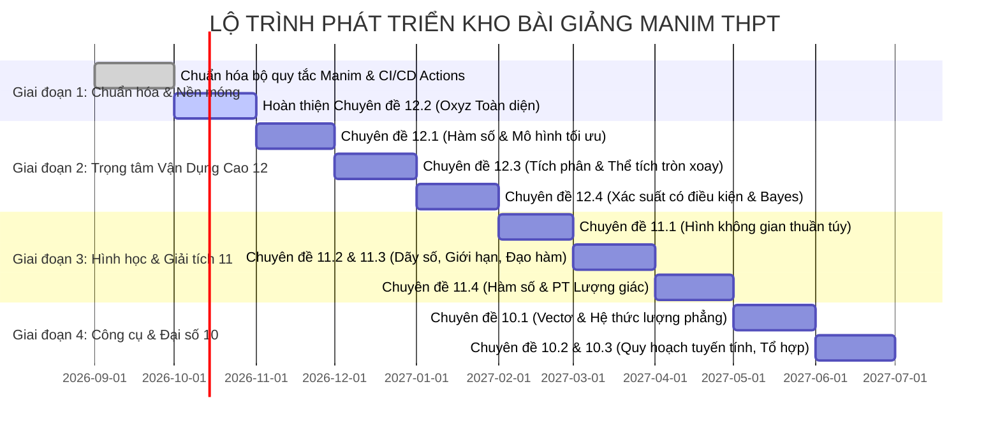

# KẾ HOẠCH TỔNG THỂ & KHUNG KIẾN TRÚC TOÁN THPT (10 - 11 - 12)
> **Thương hiệu & Tác giả:** Thầy Nguyễn Văn Sang  
> **Dự án:** Kho Code Bài Giảng Toán Trực Quan Bằng Manim & AI Voiceover  
> **Mục tiêu:** Xây dựng hệ thống bài giảng trực quan hóa toán học từ bản chất đến kỹ thuật thực chiến, phục vụ ôn luyện thi THPT Quốc gia, bồi dưỡng học sinh giỏi và phát triển tư duy toán học hiện đại.

---

## I. TƯ TƯỞNG & ĐỊNH HƯỚNG THIẾT KẾ

1. **Chuyên đề chuyên sâu - Không rập khuôn SGK:** Đi thẳng vào bản chất vấn đề, phân dạng toán kinh điển và kỹ thuật giải toán hiện đại (Sơ đồ V, ghép trục, tâm tỉ cự, tọa độ hóa, mô hình hóa thực tế).
2. **Trực quan hóa tuyệt đối bằng Manim:** Mọi định lý trừu tượng, hình học không gian, cực trị vi phân và tích phân đều được động hóa (animate) 2D/3D sinh động.
3. **Chuẩn hóa mã bài giảng:** Định danh duy nhất theo cú pháp `[Khối].[Chuyên đề].[Số thứ tự]` (Ví dụ: `Bài 12.2.08`) để đồng bộ xuyên suốt từ tên file code, workflow GitHub Actions, tiêu đề YouTube/TikTok đến học liệu PDF.
4. **Tiêu chuẩn đóng gói độc lập:** Mỗi bài giảng là một tệp Python all-in-one chạy được độc lập trên Google Colab lẫn GitHub Actions tự động render video, sinh phụ đề và thu âm AI voiceover.

---

## II. QUY ƯỚC ĐỒNG BỘ KHI TRIỂN KHAI VIDEO

### 1. Cấu trúc chuẩn 1 video (10 - 25 phút)
* **1 phút đầu (Hook & Đặt vấn đề):** Nêu ngay bài toán thực chiến hoặc câu hỏi then chốt (Tại sao phải học dạng này? Các bẫy đề thi hay gặp ở đâu?).
* **Phần 1 (Lý thuyết lõi & Bản chất hình học):** Manim mô phỏng trực quan cơ chế vận hành, rút ra công thức trọng tâm.
* **Phần 2 (Ví dụ điển hình):** Đi từ 1 bài cơ bản/thông hiểu $\rightarrow$ 1 bài mức độ vận dụng.
* **Phần 3 (Vận dụng cao / Mẹo thực chiến):** Phân tích hướng tư duy phản xạ nhanh, kỹ thuật CASIO bổ trợ, hoặc phân tích dạng biến tướng.
* **Màn hình kết thúc (Outro):** Lời kết, lời nhắc bài tập rèn luyện và link dẫn sang bài tiếp theo trong cùng chuyên đề.

### 2. Quy tắc đặt tiêu đề đăng tải (YouTube / Khóa học)
* **Cú pháp:** `[Mã bài] [Tên bài] | [Tên dạng toán / Kỹ thuật] (Mức điểm)`
* **Ví dụ mẫu:**
  * `Bài 12.2.08: Kỹ Thuật Tâm Tỉ Cự Xử Lý Cực Trị Oxyz | Vận Dụng Cao 8+ 9+`
  * `Bài 12.1.07: Cực Trị Và Đơn Điệu Hàm Hợp | Phương Pháp Sơ Đồ V & Ghép Trục (9+)`
  * `Bài 10.2.03: Miền Nghiệm & Bài Toán Quy Hoạch Tuyến Tính | Bản Chất & Thực Tế`

### 3. Tiêu chuẩn kỹ thuật Manim & Thuyết minh
* **Bộ render:** Manim Community Edition (Cairo Renderer), phân giải chuẩn 1080p/720p @ 24fps.
* **Công thức toán:** $100\%$ dùng `MathTex()`, kiểm soát dấu tiếng Việt bằng `font="DejaVu Sans"` hoặc `Noto Sans`.
* **Giọng đọc AI:** `vi-VN-NamMinhNeural` tốc độ `-5%`, khớp nối từng phân đoạn hoạt họa.
* **Thương hiệu:** Footer cố định `Thầy Nguyễn Văn Sang`, hiển thị tiến độ bài học rõ ràng.

---

## III. MA TRẬN NỘI DUNG TOÀN DIỆN 3 KHỐI LỚP

```
TỔNG HỢP: 3 KHỐI LỚP - 11 CHUYÊN ĐỀ - 70 BÀI HỌC CHUYÊN SÂU
├── KHỐI 12: 4 Chuyên đề | 33 Bài học (Trọng tâm VDC & Tốt nghiệp THPT)
├── KHỐI 11: 4 Chuyên đề | 23 Bài học (Nền tảng Giải tích & Không gian cổ điển)
└── KHỐI 10: 3 Chuyên đề | 14 Bài học (Nền tảng Công cụ Đại số & Vectơ)
```

---

### KHỐI 12: ĐỘT PHÁ VẬN DỤNG CAO & LUYỆN THI TỐT NGHIỆP

#### Chuyên đề 12.1: Giải Tích Hàm Số Chuyên Sâu & Mô Hình Tối Ưu (11 bài)
| Mã bài | Tên bài giảng & Nội dung trọng tâm | Tệp mã nguồn tương ứng | Trạng thái |
| :--- | :--- | :--- | :---: |
| **Bài 12.1.01** | Bản chất đạo hàm, dấu của đạo hàm và các bài toán biện luận đơn điệu chứa tham số $m$. | `K12-Ch1-TocDoThayDoi.py` | 🟡 Cần tinh chỉnh |
| **Bài 12.1.02** | Cực trị hàm số đại số: Kỹ thuật viết phương trình đường thẳng đi qua 2 điểm cực trị bậc 3, cực trị hàm trùng phương. | `bai_12_1_02_cuc_tri_dai_so.py` | ⚪ Chưa code |
| **Bài 12.1.03** | Min - Max hàm số trên đoạn, khoảng và kỹ thuật đặt ẩn phụ chuyển miền xác định. | `bai_12_1_03_min_max_an_phu.py` | ⚪ Chưa code |
| **Bài 12.1.04** | Tiệm cận đồ thị hàm số: Kỹ thuật xử lý hàm phân thức chứa căn, tiệm cận đứng khi mẫu có nghiệm kép/nghiệm triệt tiêu. | `duong_tiem_can_toan_12.py`<br>`ung_dung_tiem_can.py`<br>`tiem_can_thuc_te_nang_cao.py` | 🟢 Đã có code |
| **Bài 12.1.05** | Đọc đồ thị hàm số $f(x)$, $f'(x)$, $f''(x)$ và bảng biến thiên ngược. | `bai_12_1_05_doc_do_thi_bbt_nguoc.py` | ⚪ Chưa code |
| **Bài 12.1.06** | Tương tác đồ thị và phép biến đổi đồ thị: Tịnh tiến, trị tuyệt đối $\vert f(x)\vert$, $f(\vert x\vert)$, $\vert f(\vert x\vert)\vert$. | `bai_12_1_06_bien_doi_do_thi.py` | ⚪ Chưa code |
| **Bài 12.1.07** | Cực trị và đơn điệu của hàm hợp $g(x) = f(u(x))$ (Phương pháp sơ đồ V và ghép trục). | `bai_12_1_07_ham_hop_so_do_v_ghep_truc.py` | ⚪ Chưa code |
| **Bài 12.1.08** | Điểm uốn, tính lồi - lõm và ứng dụng tiếp tuyến giải bất đẳng thức/cực trị. | `bai_12_1_08_diem_uon_loi_lom.py` | ⚪ Chưa code |
| **Bài 12.1.09** | Mô hình hóa toán học 1: Bài toán tối ưu hóa chi phí sản xuất, doanh thu và lợi nhuận doanh nghiệp. | `bai_12_1_09_toi_uu_kinh_te.py` | ⚪ Chưa code |
| **Bài 12.1.10** | Mô hình hóa toán học 2: Tối ưu khoảng cách, vận tốc, lộ trình di chuyển đa địa hình (đường bộ - sông hồ). | `duong_tiem_can_toan_thuc_te.py` | 🟡 Cần tinh chỉnh |
| **Bài 12.1.11** | Mô hình hóa toán học 3: Tối ưu dung tích bao bì, kích thước hình học (gấp hộp, lát tôn, đường ống dẫn dầu). | `toi_uu_hoa_hinh_hoc_va_uon_day.py` | 🟢 Đã có code |

#### Chuyên đề 12.2: Tọa Độ Không Gian Oxyz Toàn Diện (11 bài)
| Mã bài | Tên bài giảng & Nội dung trọng tâm | Tệp mã nguồn tương ứng | Trạng thái |
| :--- | :--- | :--- | :---: |
| **Bài 12.2.01** | Hệ tọa độ Oxyz, hệ thức vectơ, tích vô hướng và tích có hướng (bản chất & ứng dụng hình học). | `bai_12_2_01_he_toa_do_oxyz_vecto.py` | ⚪ Chưa code |
| **Bài 12.2.02** | Phương trình mặt phẳng: 7 dạng lập phương trình kinh điển và phương trình đoạn chắn. | `bai_12_2_02_phuong_trinh_mat_phang.py` | ⚪ Chưa code |
| **Bài 12.2.03** | Phương trình đường thẳng: Chuyển đổi chính tắc - tham số, hình chiếu vuông góc và điểm đối xứng. | `bai_12_2_03_phuong_trinh_duong_thang.py` | ⚪ Chưa code |
| **Bài 12.2.04** | Phương trình mặt cầu: Xác định tâm - bán kính, điều kiện tạo cầu, mặt cầu ngoại tiếp tứ diện. | `bai_12_2_04_phuong_trinh_mat_cau.py` | ⚪ Chưa code |
| **Bài 12.2.05** | Bài toán góc và khoảng cách tổng hợp trong Oxyz (điểm đến mặt, điểm đến đường, khoảng cách giữa 2 đường chéo nhau). | `bai_12_2_05_goc_va_khoang_cach_oxyz.py` | ⚪ Chưa code |
| **Bài 12.2.06** | Tương giao hình học: Vị trí tương đối đường - mặt, chùm mặt phẳng và giao tuyến. | `bai_12_2_06_tuong_giao_hinh_hoc_oxyz.py` | ⚪ Chưa code |
| **Bài 12.2.07** | Kỹ thuật tọa độ hóa: Đặt hệ trục Oxyz giải quyết bài toán khối đa diện thuần túy lớp 11. | `bai_12_2_07_ky_thuat_toa_do_hoa.py` | ⚪ Chưa code |
| **Bài 12.2.08** | Vận dụng cao Oxyz 1: Phương pháp Tâm tỉ cự xử lý biểu thức độ dài $\vert\sum k_i \vec{MA_i}\vert$. | `oxyz_tam_ti_cu_hay_la_kho.py` | 🟢 Đã hoàn thành (Render xong) |
| **Bài 12.2.09** | Vận dụng cao Oxyz 2: Cực trị tổng khoảng cách và bài toán chùm tia sáng (nguyên lý Fermat). | `bai_12_2_09_cuc_tri_khoang_cach_fermat.py` | ⚪ Chưa code |
| **Bài 12.2.10** | Vận dụng cao Oxyz 3: Cực trị khoảng cách đường thẳng - mặt cầu (điểm di động, tiếp tuyến quay). | `bai_12_2_10_cuc_tri_duong_cau.py` | ⚪ Chưa code |
| **Bài 12.2.11** | Mô hình bài toán Oxyz thực tế: Vệ tinh quỹ đạo, radar quét máy bay, kết cấu giàn không gian kiến trúc. | `bai_12_2_11_oxyz_thuc_te_ve_tinh_radar.py` | ⚪ Chưa code |

#### Chuyên đề 12.3: Nguyên Hàm, Tích Phân & Hình Phẳng - Thể Tích (7 bài)
> 🔗 Đã mở rộng thành series 36 tập `INT01 → INT36`: xem [`Manim-Typst/series-nguyen-ham-tich-phan/KE_HOACH_SERIES_36_TAP.md`](Manim-Typst/series-nguyen-ham-tich-phan/KE_HOACH_SERIES_36_TAP.md). Bảng 7 bài dưới đây giữ làm mục lục rút gọn.

| Mã bài | Tên bài giảng & Nội dung trọng tâm | Tệp mã nguồn tương ứng | Trạng thái |
| :--- | :--- | :--- | :---: |
| **Bài 12.3.01** | Định nghĩa nguyên hàm, vi phân và kỹ thuật đổi biến số loại 1 & loại 2. | `bai_12_3_01_nguyen_ham_doi_bien.py` | ⚪ Chưa code |
| **Bài 12.3.02** | Kỹ thuật tích phân từng phần: Bản chất, bảng vi - tích phân đường chéo (phương pháp cột). | `bai_12_3_02_tich_phan_tung_phan_cot.py` | ⚪ Chưa code |
| **Bài 12.3.03** | Tích phân hàm phân thức hữu tỉ: Kỹ thuật tách hệ số bất định và đạo hàm mẫu. | `bai_12_3_03_tich_phan_huu_ti.py` | ⚪ Chưa code |
| **Bài 12.3.04** | Tích phân hàm ẩn và phương trình vi phân sơ cấp (dạng $f'(x) + p(x)f(x) = q(x)$). | `bai_12_3_04_tich_phan_ham_an_vi_phan.py` | ⚪ Chưa code |
| **Bài 12.3.05** | Ứng dụng tích phân: Diện tích hình phẳng giới hạn bởi nhiều đường cong, parabol, elip. | `bai_12_3_05_dien_tich_hinh_phang.py` | ⚪ Chưa code |
| **Bài 12.3.06** | Ứng dụng tích phân: Thể tích vật thể, thể tích khối tròn xoay quanh trục $Ox$, $Oy$. | `khoi_tron_xoay_cat_ghep.py` | 🟢 Đã có code |
| **Bài 12.3.07** | Ứng dụng vật lý - thực tế: Quãng đường, vận tốc biến đổi, bài toán xả nước/bơm nước bồn chứa. | `toc_do_nuoc_dang_3d_dien_tich_mat_thoang.py`<br>`toc_do_nuoc_dang_3D_pro.py` | 🟢 Đã có code |

#### Chuyên đề 12.4: Xác Suất Có Điều Kiện & Xử Lý Dữ Liệu Lớn (4 bài)
| Mã bài | Tên bài giảng & Nội dung trọng tâm | Tệp mã nguồn tương ứng | Trạng thái |
| :--- | :--- | :--- | :---: |
| **Bài 12.4.01** | Xác suất có điều kiện: Định nghĩa, không gian mẫu thu hẹp và công thức nhân xác suất. | `bai_12_4_01_xac_suat_co_dieu_kien.py` | ⚪ Chưa code |
| **Bài 12.4.02** | Công thức xác suất toàn phần và công thức Bayes trong phân tích xét nghiệm y khoa/kiểm tra lỗi sản phẩm. | `bai_12_4_02_xac_suat_toan_phan_bayes.py` | ⚪ Chưa code |
| **Bài 12.4.03** | Đại lượng ngẫu nhiên rời rạc, bảng phân bố xác suất và kỳ vọng toán học. | `bai_12_4_03_bien_ngau_nhien_ky_vong.py` | ⚪ Chưa code |
| **Bài 12.4.04** | Phân tích dữ liệu ghép nhóm: Khoảng biến thiên, tứ phân vị, phương sai và độ lệch chuẩn. | `bai_12_4_04_thong_ke_du_lieu_ghep_nhom.py` | ⚪ Chưa code |

---

### KHỐI 11: NỀN TẢNG GIẢI TÍCH & TƯ DUY KHÔNG GIAN CỔ ĐIỂN

#### Chuyên đề 11.1: Hình Học Không Gian Thuần Túy (Trọng Tâm Tư Duy) (8 bài)
| Mã bài | Tên bài giảng & Nội dung trọng tâm | Tệp mã nguồn tương ứng | Trạng thái |
| :--- | :--- | :--- | :---: |
| **Bài 11.1.01** | Đại cương không gian: Giao tuyến của hai mặt phẳng, giao điểm đường và mặt. | `bai_11_1_01_dai_cuong_giao_tuyen_giao_diem.py` | ⚪ Chưa code |
| **Bài 11.1.02** | Thiết diện của hình chóp/lăng trụ khi cắt bởi mặt phẳng (phương pháp mở rộng mặt phẳng). | `bai_11_1_02_thiet_dien_mo_rong_mat_phang.py` | ⚪ Chưa code |
| **Bài 11.1.03** | Quan hệ song song: Đường song song mặt, hai mặt phẳng song song, định lý Ta-lét trong không gian. | `bai_11_1_03_quan_he_song_song_khong_gian.py` | ⚪ Chưa code |
| **Bài 11.1.04** | Vectơ trong không gian và sự đồng phẳng của 3 vectơ. | `bai_11_1_04_vecto_khong_gian_dong_phang.py` | ⚪ Chưa code |
| **Bài 11.1.05** | Đường thẳng vuông góc mặt phẳng: Kỹ thuật dựng chân đường cao hình chóp (đỉnh thẳng đứng, mặt bên vuông góc đáy). | `bai_11_1_05_duong_vuong_goc_mat_chan_duong_cao.py` | ⚪ Chưa code |
| **Bài 11.1.06** | Hai mặt phẳng vuông góc và góc giữa hai mặt phẳng (Kỹ thuật dựng góc 2 bước). | `bai_11_1_06_goc_giua_hai_mat_phang.py` | ⚪ Chưa code |
| **Bài 11.1.07** | Khoảng cách từ một điểm đến một mặt phẳng: Phương pháp "chuyển điểm" (về chân đường vuông góc). | `bai_11_1_07_khoang_cach_diem_den_mat_chuyen_diem.py` | ⚪ Chưa code |
| **Bài 11.1.08** | Khoảng cách giữa hai đường thẳng chéo nhau: 3 mô hình dựng đoạn vuông góc chung và mặt phẳng song song. | `bai_11_1_08_khoang_cach_hai_duong_cheo_nhau.py` | ⚪ Chưa code |

#### Chuyên đề 11.2: Dãy Số, Quy Nạp & Giới Hạn (7 bài)
| Mã bài | Tên bài giảng & Nội dung trọng tâm | Tệp mã nguồn tương ứng | Trạng thái |
| :--- | :--- | :--- | :---: |
| **Bài 11.2.01** | Phương pháp quy nạp toán học chứng minh bất đẳng thức và tính chia hết. | `bai_11_2_01_quy_nap_toan_hoc.py` | ⚪ Chưa code |
| **Bài 11.2.02** | Cấp số cộng: Thiết lập công thức tổng, tính chất và các bài toán tài chính gửi góp định kỳ. | `bai_11_2_02_cap_so_cong_tai_chinh.py` | ⚪ Chưa code |
| **Bài 11.2.03** | Cấp số nhân: Tổng cấp số nhân lùi vô hạn và bài toán fractal/tăng trưởng dân số. | `bai_11_2_03_cap_so_nhan_lui_vo_han_fractal.py` | ⚪ Chưa code |
| **Bài 11.2.04** | Kỹ thuật tìm số hạng tổng quát của dãy số truy hồi tuyến tính cấp 1 và cấp 2. | `bai_11_2_04_day_so_truy_hoi_tuyen_tinh.py` | ⚪ Chưa code |
| **Bài 11.2.05** | Giới hạn dãy số: Kỹ thuật liên hợp khử vô định $[\infty - \infty]$ và nguyên lý kẹp. | `bai_11_2_05_gioi_han_day_so_khu_vo_dinh.py` | ⚪ Chưa code |
| **Bài 11.2.06** | Giới hạn hàm số: Xử lý dạng vô định $\frac{0}{0}$, $\frac{\infty}{\infty}$, $0 \cdot \infty$. | `bai_11_2_06_gioi_han_ham_so.py` | ⚪ Chưa code |
| **Bài 11.2.07** | Hàm số liên tục: Định lý giá trị trung gian và chứng minh phương trình có nghiệm. | `bai_11_2_07_ham_so_lien_tuc_dinh_ly_gia_tri_trung_gian.py` | ⚪ Chưa code |

#### Chuyên đề 11.3: Đạo Hàm Cơ Bản & Tiếp Tuyến (4 bài)
| Mã bài | Tên bài giảng & Nội dung trọng tâm | Tệp mã nguồn tương ứng | Trạng thái |
| :--- | :--- | :--- | :---: |
| **Bài 11.3.01** | Định nghĩa đạo hàm bằng giới hạn và ý nghĩa vật lý (vận tốc tức thời, gia tốc). | `bai_11_3_01_dinh_nghia_dao_ham_y_nghia_vat_ly.py` | ⚪ Chưa code |
| **Bài 11.3.02** | Quy tắc tính đạo hàm hàm đa thức, lượng giác, tích, thương và đạo hàm hàm hợp. | `bai_11_3_02_quy_tac_tinh_dao_ham.py` | ⚪ Chưa code |
| **Bài 11.3.03** | Phương trình tiếp tuyến của đồ thị: Tại 1 điểm, đi qua 1 điểm, có hệ số góc cho trước. | `bai_11_3_03_phuong_trinh_tiep_tuyen.py` | ⚪ Chưa code |
| **Bài 11.3.04** | Vi phân và ứng dụng tính gần đúng sai số. | `bai_11_3_04_vi_phan_ung_dung_gan_dung.py` | ⚪ Chưa code |

#### Chuyên đề 11.4: Hàm Số & Phương Trình Lượng Giác (4 bài)
| Mã bài | Tên bài giảng & Nội dung trọng tâm | Tệp mã nguồn tương ứng | Trạng thái |
| :--- | :--- | :--- | :---: |
| **Bài 11.4.01** | Biến đổi lượng giác chuyên sâu: Công thức cộng, nhân đôi, biến đổi tích thành tổng. | `bai_11_4_01_bien_doi_luong_giac_chuyen_sau.py` | ⚪ Chưa code |
| **Bài 11.4.02** | Đồ thị và tập xác định, tính tuần hoàn, chu kỳ của 4 hàm lượng giác cơ bản. | `bai_11_4_02_do_thi_ham_so_luong_giac.py` | ⚪ Chưa code |
| **Bài 11.4.03** | Phương trình lượng giác cơ bản và phương trình bậc nhất theo $\sin x$ và $\cos x$ ($a\sin x + b\cos x = c$). | `bai_11_4_03_phuong_trinh_luong_giac_bac_nhat.py` | ⚪ Chưa code |
| **Bài 11.4.04** | Phương trình đẳng cấp bậc 2, bậc 3 và phương trình đối xứng theo $\sin x \pm \cos x$. | `bai_11_4_04_phuong_trinh_dang_cap_doi_xung.py` | ⚪ Chưa code |

---

### KHỐI 10: NỀN TẢNG CÔNG CỤ ĐẠI SỐ & HÌNH HỌC VECTƠ

#### Chuyên đề 10.1: Vectơ & Hệ Thức Lượng Hình Học Phẳng (8 bài)
| Mã bài | Tên bài giảng & Nội dung trọng tâm | Tệp mã nguồn tương ứng | Trạng thái |
| :--- | :--- | :--- | :---: |
| **Bài 10.1.01** | Bản chất vectơ: Phép cộng, trừ theo quy tắc 3 điểm, hình bình hành, trung điểm, trọng tâm. | `bai_10_1_01_ban_chat_vecto_phep_toan.py` | ⚪ Chưa code |
| **Bài 10.1.02** | Kỹ thuật phân tích (biểu diễn) một vectơ theo hai vectơ không cùng phương. | `bai_10_1_02_phan_tich_vecto.py` | ⚪ Chưa code |
| **Bài 10.1.03** | Tích vô hướng của hai vectơ: Định nghĩa góc, tính chất và điều kiện vuông góc. | `bai_10_1_03_tich_vo_huong_vecto.py` | ⚪ Chưa code |
| **Bài 10.1.04** | Định lý Cosin, định lý Sin và các công thức tính diện tích tam giác (Heron, bán kính $R, r$). | `bai_10_1_04_dinh_ly_sin_cosin_dien_tich.py` | ⚪ Chưa code |
| **Bài 10.1.05** | Ứng dụng hệ thức lượng giải bài toán đo đạc thực địa (chiều cao tháp, khoảng cách không thể tới). | `bai_10_1_05_do_dac_thuc_dia.py` | ⚪ Chưa code |
| **Bài 10.1.06** | Tọa độ Oxy: Phương trình tham số, phương trình tổng quát của đường thẳng. | `bai_10_1_06_toa_do_oxy_duong_thang.py` | ⚪ Chưa code |
| **Bài 10.1.07** | Phương trình đường tròn và vị trí tương đối giữa đường thẳng và đường tròn trong Oxy. | `bai_10_1_07_duong_tron_va_vi_tri_tuong_doi.py` | ⚪ Chưa code |
| **Bài 10.1.08** | Ba đường Conic (Elip, Hypebol, Parabol): Định nghĩa tiêu điểm, tiêu cự, tâm sai và phương trình chính tắc. | `bai_10_1_08_ba_duong_conic.py` | ⚪ Chưa code |

#### Chuyên đề 10.2: Đại Số & Phương Pháp Tối Ưu Hóa Tuyến Tính (6 bài)
| Mã bài | Tên bài giảng & Nội dung trọng tâm | Tệp mã nguồn tương ứng | Trạng thái |
| :--- | :--- | :--- | :---: |
| **Bài 10.2.01** | Mệnh đề toán học, phủ định mệnh đề và các phép toán trên tập hợp số ($\mathbb{R}$). | `bai_10_2_01_menh_de_tap_hop.py` | ⚪ Chưa code |
| **Bài 10.2.02** | Bất phương trình và hệ bất phương trình bậc nhất hai ẩn. | `bat_phuong_trinh_hai_an.py`<br>`he_bat_phuong_trinh_hai_an.py` | 🟢 Đã có code |
| **Bài 10.2.03** | Miền nghiệm trên mặt phẳng tọa độ và bài toán Quy hoạch tuyến tính (tìm $F(x,y)$ lớn nhất/nhỏ nhất trong kinh tế). | `bai_toan_thuc_te_bat_phuong_trinh.py` | 🟢 Đã có code |
| **Bài 10.2.04** | Hàm số bậc hai $y = ax^2 + bx + c$: Khảo sát sự biến thiên, vẽ parabol và tìm giá trị lớn nhất/nhỏ nhất. | `bai_10_2_04_ham_so_bac_hai_parabol.py` | ⚪ Chưa code |
| **Bài 10.2.05** | Dấu của tam thức bậc hai và phương pháp xét dấu tích - thương. | `bai_10_2_05_dau_tam_thuc_bac_hai.py` | ⚪ Chưa code |
| **Bài 10.2.06** | Phương trình chứa căn thức sơ cấp: Kỹ thuật đặt điều kiện và bình phương khử căn. | `bai_10_2_06_phuong_trinh_chua_can.py` | ⚪ Chưa code |

#### Chuyên đề 10.3: Đại Số Tổ Hợp & Nhị Thức Newton (4 bài)
| Mã bài | Tên bài giảng & Nội dung trọng tâm | Tệp mã nguồn tương ứng | Trạng thái |
| :--- | :--- | :--- | :---: |
| **Bài 10.3.01** | Quy tắc cộng, quy tắc nhân và sơ đồ hình cây trong đếm phần tử. | `bai_10_3_01_quy_tac_dem_so_do_cay.py` | ⚪ Chưa code |
| **Bài 10.3.02** | Phân biệt Hoán vị ($P_n$), Chỉnh hợp ($A_n^k$) và Tổ hợp ($C_n^k$) qua các bài toán thực tế. | `bai_10_3_02_hoan_vi_chinh_hop_to_hop.py` | ⚪ Chưa code |
| **Bài 10.3.03** | Khai triển Nhị thức Newton: Kỹ thuật tìm hệ số của số hạng chứa $x^k$. | `bai_10_3_03_nhi_thuc_newton_tim_he_so.py` | ⚪ Chưa code |
| **Bài 10.3.04** | Xác suất cổ điển: Định nghĩa cổ điển, biến cố đối và quy tắc cộng/nhân xác suất cơ bản. | `bai_10_3_04_xac_suat_co_dien_bien_co_doi.py` | ⚪ Chưa code |

---

## IV. LỘ TRÌNH THỰC THI (ROADMAP & MILESTONES)



---

## V. NGUYÊN TẮC QUẢN TRỊ MÃ NGUỒN & QUY TRÌNH SẢN XUẤT

1. **Chuẩn hóa đặt tên file Python:**
   * Cú pháp bắt buộc: `bai_[khối]_[chuyên đề]_[stt]_[tên_dạng_khong_dau].py`
   * Ví dụ: `bai_12_2_08_tam_ti_cu_cuc_tri_oxyz.py`
2. **Quy trình 5 bước sản xuất 1 bài giảng:**
   1. **Soạn kịch bản sư phạm:** Xác định bài toán dẫn dắt $\rightarrow$ Công thức cốt lõi $\rightarrow$ Ví dụ VDC $\rightarrow$ Lời thoại Voiceover.
   2. **Viết code Manim độc lập:** Tuân thủ `QUY_TAC_MANIM.md` và `Quy-Tac-Manim-Chuan.md`, sử dụng `MathTex` cho toán học.
   3. **Kiểm thử cục bộ (Smoke test):** Render ở chế độ draft preview (`-ql`, fps thấp) để kiểm tra bố cục và khớp audio.
   4. **Render tự động qua GitHub Actions:** Đẩy code lên GitHub, kích hoạt workflow `Render Manim Video` để runner Cloud xử lý render chất lượng cao (1080p, 24fps) mà không tốn tài nguyên máy cá nhân.
   5. **Đóng gói & Tải về:** Tải gói Artifact gồm `video.mp4`, `phụ đề .srt/.vtt`, `mục lục.txt` và `mã nguồn.zip` để lưu trữ và đăng tải.
